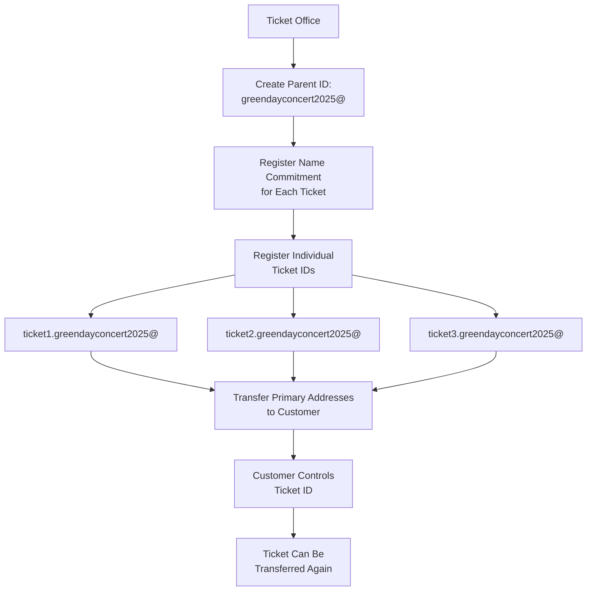
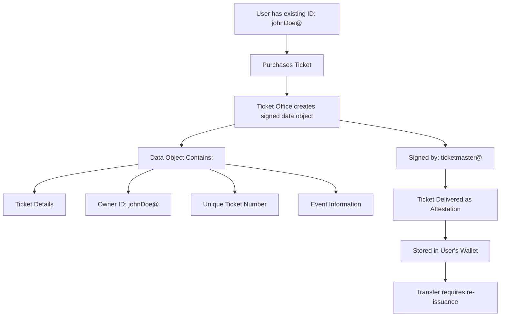

# Creating Tickets on Verus Blockchain: A Comparative Analysis

## Introduction

The Verus blockchain offers unique capabilities for creating digital tickets through its innovative identity system. This document explores two distinct approaches to ticket creation on Verus, examining their mechanisms, advantages, disadvantages, and practical implications for real-world ticketing systems.

Unlike traditional blockchain approaches that rely on smart contracts, Verus provides native identity primitives that can serve as blockchain-native objects with built-in consensus validation. This fundamental difference opens up new possibilities for ticket creation and management.

## Method A: Identity-Based Tickets (ID as Ticket)

### Overview

In this approach, each ticket is represented by a unique Verus Identity (ID). The ticket office creates individual IDs for each ticket, with the ID itself serving as the transferable ticket asset.

### How It Works



#### Process Flow:
```

#### Process Flow:

1. **Parent ID Creation**: Ticket office creates a parent identity (e.g., `greendayconcert2025@`)
2. **Ticket ID Minting**: For each ticket, create a sub-identity (e.g., `ticket1.greendayconcert2025@`)
3. **Multi-signature Setup**: Configure primary addresses with up to 15 keys
4. **Shared Control Option**: Include both ticket office and customer addresses for hybrid control
5. **Transfer Mechanism**: Update primary addresses to transfer ownership

#### Technical Implementation:

```bash
# Step 1: Register name commitment for ticket
verus -chain=vrsctest registernamecommitment "ticket1" "TicketOfficeAddress" "" "greendayconcert2025"

# Step 2: Register the ticket identity
verus -chain=vrsctest registeridentity '{
  "txid": "commitment_txid",
  "namereservation": {...},
  "identity": {
    "name": "ticket1.greendayconcert2025",
    "primaryaddresses": ["TicketOfficeAddress", "CustomerAddress"],
    "minimumsignatures": 2,
    "contentmultimap": {
      "event_details": "Green Day Concert 2025...",
      "seat_info": "Section A, Row 5, Seat 12",
      "price": "$150.00"
    }
  }
}'

# Step 3: Transfer ticket by updating primary addresses
verus -chain=vrsctest updateidentity '{
  "name": "ticket1.greendayconcert2025",
  "primaryaddresses": ["NewOwnerAddress"]
}'
```

### Pros and Cons

| Pros | Cons |
|------|------|
| ✅ **Native Blockchain Support**: IDs are blockchain primitives with consensus validation | ❌ **Transaction Costs**: Each ticket requires 2+ blockchain transactions |
| ✅ **True Ownership**: Complete control transfer without intermediaries | ❌ **Scalability Issues**: Creating 1000s of tickets becomes trickier |
| ✅ **Rich Data Storage**: Up to ~4KB of data per ticket in contentmap | ❌ **Complex Mass Creation**: Difficult to automate large-scale ticket generation until more software tools available |
| ✅ **Multi-signature Capability**: Flexible control structures (1-15 keys) | ❌ **Update Transaction Fees**: Each transfer requires blockchain transaction |
| ✅ **Wallet Integration**: Current Valu Mobile app supports ID transfers | ❌ **Technical Complexity**: Requires blockchain interaction knowledge |
| ✅ **Immutable Proof**: Blockchain-verified ownership and authenticity | ❌ **Time Dependency**: Must wait for block confirmations |
| ✅ **No Intermediary Risk**: Direct peer-to-peer transfers possible | ❌ **Lost Key Risk**: If private keys are lost, ticket is permanently inaccessible |

## Method B: Attestation-Based Tickets (Signed Data Objects)

### Overview

This method uses existing user identities and creates signed data objects (attestations) that represent tickets. The ticket office signs ticket data with their identity, creating a verifiable claim of ownership.

### How It Works



#### Process Flow:

1. **User Identity**: Customer uses existing Verus ID (e.g., `johnDoe@`)
2. **Ticket Creation**: Ticket office creates signed data object off-chain
3. **Digital Signature**: Object signed by ticket office's ID at specific block height
4. **Delivery**: Signed ticket object sent to customer's wallet
5. **Verification**: Blockchain validates signature and ticket office identity

#### Technical Implementation:

```json
{
  "ticket_object": {
    "ticket_id": "GT2025-NYC-A05-012",
    "event": "Green Day Concert 2025",
    "venue": "Madison Square Garden",
    "date": "2025-05-15T20:00:00Z",
    "seat": "Section A, Row 5, Seat 12",
    "price": "$150.00",
    "owner_id": "johnDoe@",
    "issued_height": 255187,
    "terms": "Non-refundable, non-transferable without re-issuance"
  },
  "signature": {
    "signer": "ticketmaster@",
    "signature_data": "3045022100...",
    "block_height": 255187,
    "timestamp": "2025-05-01T10:30:00Z"
  },
  "merkle_proof": {
    "hash": "a7b8c9d0e1f2...",
    "proof_chain": ["...", "...", "..."]
  }
}
```

### Pros and Cons

| Pros | Cons |
|------|------|
| ✅ **Cost Effective**: No blockchain transactions for ticket creation | ❌ **Transfer Complexity**: Requires re-issuance for transfers |
| ✅ **Mass Creation**: Easy to generate thousands of tickets offline | ❌ **Intermediary Dependency**: Ticket office must facilitate transfers if change of personal details on ticket |
| ✅ **Instant Generation**: No waiting for block confirmations | ❌ **Software Limitations**: Current wallet apps need ticket-specific features |
| ✅ **Existing Infrastructure**: Uses current attestation/claim systems | ❌ **Privacy Concerns**: All recipient info needed at purchase time |
| ✅ **Flexible Data**: Can contain any structured ticket information | ❌ **Limited Autonomy**: Users can't independently transfer tickets |
| ✅ **Zero Knowledge**: Supports ZK attestations and merkle proofs | ❌ **Trust Requirements**: Relies on ticket office's continued operation  |
| ✅ **Offline Capability**: Tickets work without constant blockchain access |  |

## Detailed Comparison Matrix

| Aspect | Method A (ID as Ticket) | Method B (Signed Objects) |
|--------|------------------------|---------------------------|
| **Creation Cost** | (2+ transactions per ticket) | Low (off-chain creation) |
| **Scalability** | Limited by blockchain throughput possibly | Highly scalable |
| **Transfer Method** | Blockchain transaction required | Re-issuance by ticket office |
| **User Autonomy** | Complete ownership control | Dependent on ticket office, or new software to re-sign tickets |
| **Technical Complexity** | High (blockchain interactions) | Medium (signature verification) |
| **Wallet Support** | Currently supported | Requires development |
| **Mass Distribution** | Challenging | Easy |
| **Dispute Resolution** | Blockchain immutability | Requires ticket office arbitration |
| **Secondary Market** | Natural peer-to-peer | Controlled by ticket office |

## Use Case Scenarios

### Large Venue Concert (10,000+ tickets)

**Method A Challenges:**
- ~20,000 blockchain transactions needed
- Time requirement: BAtched up transactions take hours
- Infrastructure: Requires robust transaction management system

**Method B Advantages:**
- Instant ticket generation
- Near-zero marginal cost per ticket
- Immediate distribution capability
- Scalable to any event size

### Premium/VIP Tickets (Limited quantity, high value)

**Method A Advantages:**
- Provable scarcity and authenticity
- Complete ownership rights
- Resale market functionality
- Collectible value potential

**Method B Limitations:**
- Harder to prove uniqueness
- Transfer restrictions may reduce value
- Less suitable for collector markets

### Corporate Events (Internal distribution)

**Method A Considerations:**
- May be overkill for internal events
- High setup cost for single-use events

**Method B Benefits:**
- Quick deployment
- Easy management
- Cost-effective for one-time events
- Simplified distribution to employee IDs

## Future Development Considerations

### Software Requirements

**Method A:**
- Enhanced wallet transaction capabilities
- Batch transaction processing
- User-friendly ID management interfaces

**Method B:**
- Ticket-specific wallet features
- Transfer request systems
- Enhanced attestation management
- QR code integration improvements

### Technical Roadmap

1. **Short-term** (2-4 weeks):
   - Basic ticket object support in wallets
   - Simple transfer request mechanisms
   - QR code ticket display

2. **Medium-term** (2-3 months):
   - Batch ID creation tools
   - Advanced ticket management features
   - Secondary market interfaces

3. **Long-term** (6-12 months):
   - Advanced software integration
   - Machine-readable ticket formats

## Economic Analysis

### Revenue Model Implications

**Method A:**
- Higher operational costs may require premium pricing
- Natural scarcity supports higher ticket values
- Resale market generates ongoing network activity

**Method B:**
- Lower operational costs enable competitive pricing
- Centralized control over secondary markets
- Reduced infrastructure investment requirements

## Security Analysis

### Attack Vectors

**Method A Vulnerabilities:**
- Private key compromise (permanent ticket loss)
- Replay attacks during transfers
- Blockchain reorganization risks

**Method A Mitigations:**
- Multi-signature ticket IDs
- Confirmation requirements

**Method B Vulnerabilities:**
- Ticket office key compromise (affects all tickets)
- Signature replay attacks
- Time-based signature validity issues

**Method B Mitigations:**
- Key rotation policies
- Height-based signature validation
- Merkle tree attestations

## Regulatory and Compliance Considerations

### Consumer Protection

**Method A:**
- Irreversible transactions may conflict with consumer rights
- Clear ownership transfer documentation
- Potential for permanent loss scenarios

**Method B:**
- Ticket office retains some control for dispute resolution
- More traditional ticketing compliance alignment
- Easier refund/cancellation procedures

### Anti-Fraud Measures

**Method A:**
- Blockchain immutability prevents ticket duplication
- Cryptographic proof of authenticity
- Transparent ownership history

**Method B:**
- Digital signatures prevent forgery
- Centralized validation reduces fake tickets
- Ticket office control enables quick response to fraud

## Conclusion

Both methods offer distinct advantages for different use cases:

**Method A (ID as Ticket)** excels in scenarios requiring:
- True decentralized ownership
- High-value or collectible tickets
- Secondary market functionality
- Maximum user autonomy

**Method B (Signed Objects)** is optimal for:
- Large-scale events
- Cost-sensitive operations
- Rapid deployment requirements
- Traditional ticketing business models

The choice between methods should be based on specific event requirements, cost considerations, technical capabilities, and business model preferences. Many organizations may benefit from a hybrid approach, using Method B for general admission and Method A for premium or collectible tickets.

As the Verus ecosystem continues to evolve, improvements in wallet software, batch processing capabilities, and user interfaces will likely make both methods more accessible and practical for mainstream adoption.


---

*This document represents a technical analysis as of September 2025. Verus protocol features and capabilities may evolve over time.*